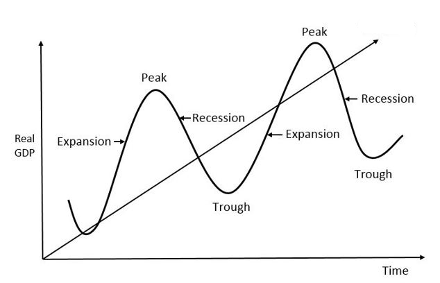

    CHU KÌ KINH TẾ (BUSINESS CYCLE)

## I. Chu kì kinh tế là gì?

   
  
   

Là `sự tăng giảm sản lượng hàng hóa và dịch vụ trong một nền kinh tế`. Các chu kì kinh tế `được đo lường bằng cách sử dụng mức tăng và giảm của GDP`

---

## II. Các giai đoạn của chu kì kinh tế

### 1. Mở rộng (Expansion)

- `Sự gia tăng sản xuất, lạm phát và lãi suất` đều `có xu hướng tăng` \
- `Tỷ lệ việc làm cao`, có nghĩa người lao động có thể đòi lương cao hơn, gây áp lực lên chi phí và giá cả \
- `Lãi suất tăng` khi ngày càng có nhiều người và cty yêu cầu tín dụng để tài trợ cho chi tiêu hoặc đầu tư của họ

### 2. Đỉnh (Peak)

- `Tăng trưởng kinh tế đạt mức tối đa` và `tốc độ tăng trưởng bắt đầu chậm lại` \
- `Các ngân hàng trung ương` có thể `thực hiện các chính sách thắt chặt` để `làm chậm nền kinh tế và kiểm soát lạm phát` \
- `Lạm phát tiếp tục tăng`

### 3. Suy thoái (Recession or Contraction)

- `Toàn bộ hoạt động trong nền kinh tế` nhìn chung `đều giảm sút` \
- `Lạm phát và lãi suất đều có xu hướng giảm`. Các ngân hàng trung ương thường `thực hiện các chính sách tài khóa và tiền tệ mở rộng` để `kích thích tăng trưởng kinh tế`
- `Mức lương thấp`, `tỉ lệ thất nghiệp cao`

### 4. Đáy (Trough)

- Là thời điểm mà `tăng trưởng kinh tế ở mức thấp nhất`,
- `Tốc độ tăng trưởng kinh tế bắt đầu ổn định` và không còn sự suy giảm nào nữa \
- `Lãi suất thấp hơn` có thể khuyến khích vay nhiều hơn để chi tiêu thuần túy \
- `Tốc độ tăng trưởng kinh tế bắt đầu được cải thiện` và nền kinh tế bước vào giai đoạn phục hồi

### 5. Phục hồi (Recovery)

- Đánh dấu `sự kết thúc của giai đoạn suy thoái`, nền kinh tế bắt đầu phục hồi \
