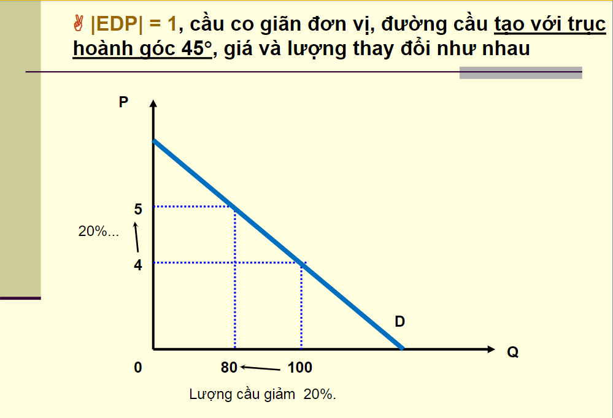
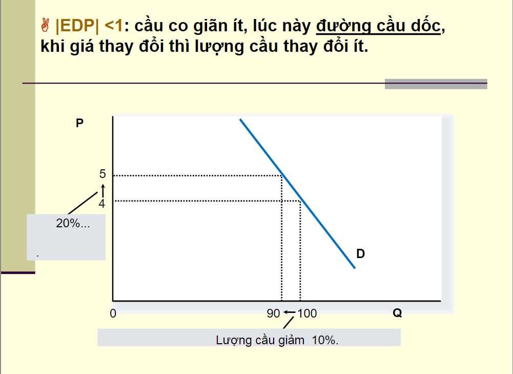
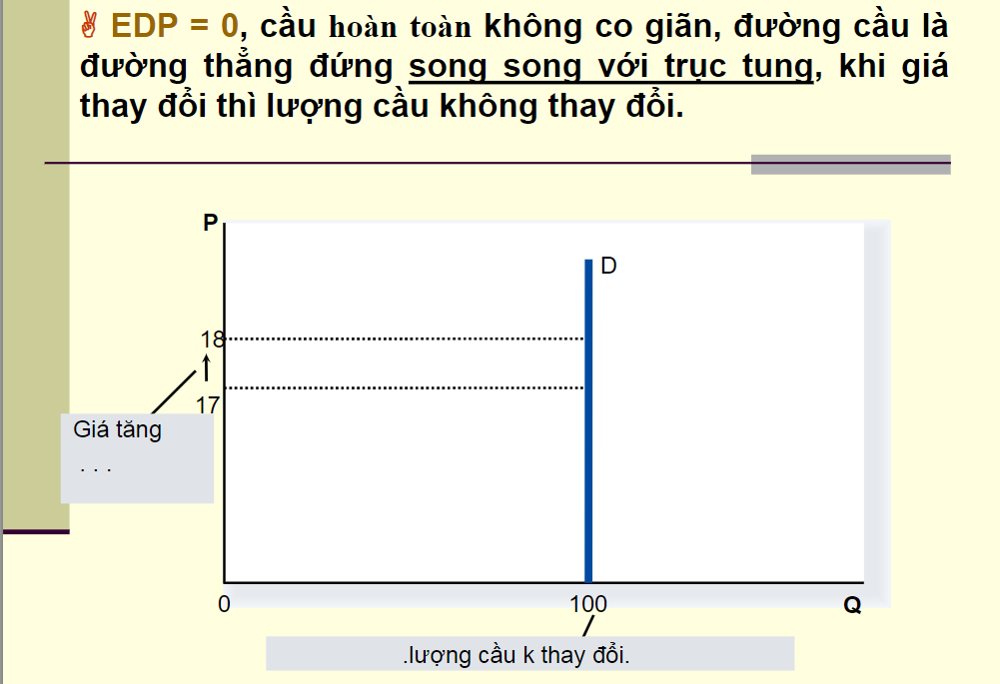
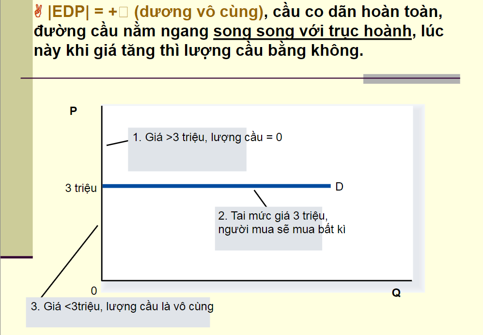

   
    ĐỘ CO GIÃN CỦA CẦU THEO GIÁ (PRICE ELASTICITY OF DEMAND)
    https://vietnambiz.vn/do-co-gian-cua-cau-theo-gia-price-elasticity-of-demand-la-gi-20190826145855394.htm

------------------------------------------------------------------------------------------------------

## I. Độ co giãn của cầu theo giá là gì?
  Là `sự thay đổi của lượng cầu` khi `có sự thay đổi của giá` \
  Công thức: 
  - EDP = % Change in quantity demanded / % Change in price \
  
  Ví dụ
  - Giá xăng tăng 10% 
  - Lượng cầu xăng giảm 2.5%
  - EDP = -2.5% / 10% = -0.25

------------------------------------------------------------------------------------------------------

## II. Cách trường hợp co giãn của cầu

### 1. Co giãn điểm
  Là `sự co giãn` tại `một điểm trên đường cầu`, được áp dụng khi `có sự thay đổi vô cùng nhỏ của lượng cầu` và `các yếu tố ảnh hưởng` \
  Công thức:
  - EDP = 

### 2. Co giãn đoạn
  Là `sự co giãn` trên `một đoạn hữu hạn của đường cầu`, được áp dụng khi `có sự thay đổi lớn và rời rạc của lượng cầu` và `các yếu tố ảnh hưởng` \
  Công thức: 
  - EDP = %ΔQd / %ΔP
  - _____= (Q2 - Q1 / Q2 + Q1) / (P2 - P1 / P2 + P1)

------------------------------------------------------------------------------------------------------

## III. Phân loại độ co giãn của cầu theo giá

### 1. Cầu co giãn tương đối: EDP > 1
  Sự thay đổi của giá cả `ảnh hưởng đáng kể đến cầu`. Điều này có thể bởi vì các loại hàng hóa này `có nhiều loại hàng hóa thay thế` \
  Mối quan hệ giữa giá và doanh thu `là nghịch chiều` - Giá tăng thì doanh thu giảm và ngược lại \
  Ví dụ: dịch vụ làm đẹp, lương thực thực phẩm

   
  
   

### 2. Cầu co giãn đơn vị: EDP = 1
  `Tỉ lệ thay đổi của cầu đối` với hàng hóa và dịch vụ `bằng tỉ lệ thay đổi giá cả của chúng`. Tuy nhiên, trường hợp này ít xảy ra \
  Giá thay đổi ko làm thay đổi doanh thu

   
  
   

### 3. Cầu ít co giãn: EDP < 1
  Sự thay đổi giá cả `không ảnh hưởng nhiều` đến cầu. Điều này có thể bởi vì các loại hàng hóa này `cần thiết hoặc khó tìm thấy hàng hóa thay thế` \
  Mối quan hệ giữa giá và doanh thu là thuận chiều - Giá tăng thì doanh thu tăng \
  Ví dụ: Điện, xăng

   
  
   

### 4. Cầu không co giãn: EDP = 0
  Sự thay đổi về giá `không ảnh hưởng` đến cầu. Điều này có thể bởi vì đây `là những sản phẩm bắt buộc` và `không có bất kì hàng hóa nào có thể thay thế` \
  Ví dụ: thuốc điều trị đặc biệt

   
  
   

### 5. Cầu co giãn hoàn toàn: EDP = ∞
  Sự gia tăng nhỏ trong giá sẽ `làm lượng cầu giảm bằng 0` \
  Ví dụ: Chỉ có trong lý thuyết

   
  
   

------------------------------------------------------------------------------------------------------

## 5. Độ co giãn chéo của cầu (Cross Elasticity of Demand)

### 1. Độ co giãn chéo của cầu là gì?
  Đo lường `phản ứng của cầu về một loại hàng hóa (X)` trước `sự thay đổi trong giá cả của một loại hàng hóa khác (Y)` \
  Công thức: 
  - EXY = %ΔQDX / %ΔPY

  Trong đó
  - EXP là độ co giãn của cầu về hàng hóa X theo giá của hàng hóa Y
  - QDX là lượng cầu của hàng hóa X
  - PY là giá của hàng hóa Y
  - Δ biểu thị mức thay đổi

### 2. Ý nghĩa
  `Độ co giãn chéo > 0`: X và Y là `hàng hóa thay thế` (Substitute Goods) \
  `Độ co giãn chéo < 0`: X và Y là `hàng hóa bổ sung` (Complement Goods)

---------------------------------------------------------------------------------------

   