# Giá trị hiện tại (Present Value) và Giá trị tương lai (Future Value)

## I. Giá trị hiện tại của dòng tiền là gì?

Giá trị hiện tại của một dòng tiền là `giá trị tương ứng của dòng tiền đó` khi `quy về thời điểm hiện tại`

---

## II. Giá trị tương lai của dòng tiền là gì?

Giá trị tương lai `tại thời điểm N` của một dòng tiền là `giá trị tương ứng của dòng tiền đó` tại `thời điểm N trong tương lai`

---

## III. Phân loại các dòng tiền

### 1. Dòng tiền đơn

Là `một khoản tiền`, phát sinh `tại một thời điểm nhất định`

 
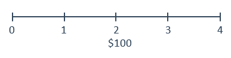
 
 

| Present Value Formula                                         | Future Value Formula                                          |
| ------------------------------------------------------------- | ------------------------------------------------------------- |
| 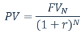 | 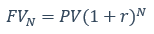 |

Trong đó:

- `FVn (Future value at time N)`: giá trị tương lai tại thời điểm N
- `PV (Present value)`: giá trị hiện tại
- `r (Interest rate per period)`: lãi suất mỗi kỳ
- `N (Num of periods)`: số chu kỳ

---

### 2. Các dòng tiền bằng nhau - Dòng tiền niên kim trả cuối kỳ `(Ordinary Annuity)`

Là `dòng tiền đều`, `phát sinh ở cuối kỳ`, trong một khoản thời gian nhất định

 
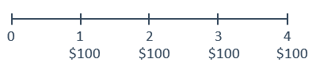
 
 

| Present Value Formula                                          | Future Value Formula                                           |
| -------------------------------------------------------------- | -------------------------------------------------------------- |
| 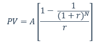 | 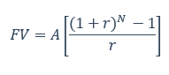 |

Trong đó:

- `A (annuity amount)`: số tiền niêm kim
- `N (number of regular annuity payments/periods)`: số lần thanh toán niên kim/số kỳ
- `r (interest rate per period)`: lãi suất mỗi kỳ

---

### 3. Các dòng tiền bằng nhau - Dòng tiền niên kim trả đầu kỳ `(Annuity Due)`

Là `dòng tiền đều`, `phát sinh ở đầu kỳ`, trong một khoản thời gian nhất định

 
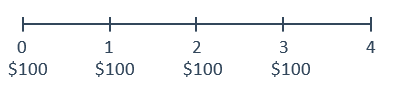
 
 

| Present Value Formula                                    | Future Value Formula                                      |
| -------------------------------------------------------- | --------------------------------------------------------- |
| 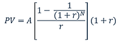 | 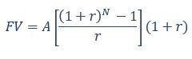 |

Trong đó:

- `A (annuity amount)`: số tiền niêm kim
- `N (number of regular annuity payments/periods)`: số lần thanh toán niên kim/số kỳ
- `r (interest rate per period)`: lãi suất mỗi kỳ

---

### 4. Các dòng tiền bằng nhau - Dòng niên kim vĩnh cửu `(Perpetuity)`

Là `dòng tiền đều`, `phát sinh ở cuối kỳ`, `không bao giờ kết thúc`

 
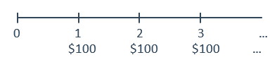
 

Present Value Formula:

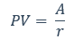
 
 

Trong đó:

- `A (annuity amount)`: số tiền niêm kim
- `r (interest rate per period)`: lãi suất mỗi kỳ

---

### 5. Các dòng tiền không bằng nhau

Là `dòng tiền không đều`, có thể `phát sinh ở bất kì thời điểm nào` trong một khoản thời gian nhất định

 

 
 

Preset Value Formula: `tổng giá trị quy về hiện tại` của mỗi dòng tiền trong chuỗi

Future Value Formala: `tổng giá trị tương lai` của mỗi dòng tiền trong chuỗi
