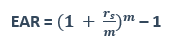

# Lãi suất thực hưởng (Effective Annual Rate)

## I. Lãi suất thực hưởng là gì?

Là `lãi suất thực sự kiếm được` và `lớn hơn lãi suất mà ngân hàng công bố hàng năm` do `kết quả bao gồm cả lãi của các kỳ trước đó` (hàng quý, hàng tháng, hàng năm)

Công thức:

 

Trong đó:

- EAR (Effective annual rate): lãi suất thực hưởng
- rs (Stated annual interest rate or Quoted interest rate): lãi suất công bố hàng năm
- m: số kỳ ghép lãi trong một năm

Ví dụ:

Tính lãi suất thực hưởng biết lãi suất công bố là 12%, ghép lãi theo quý

EAR = (1 + 0.12/4) ^ 4 - 1 = 0.1255 = 12.55%
