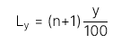
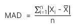

# Đo lường về vị trí và xu hướng phân tán

## I. Đo lường điểm phân vị và minh họa các điểm phân vị bằng hình ảnh

### 1. Quantile

Thuật ngữ chung cho `một giá trị bằng hoặc thấp hơn tỉ lệ đã nêu của dữ liệu` trong `một phân phối`

Công thức:

 
 

Trong đó:

- y: điểm phần trăm để phân chia phân phối
- n: số lượng điểm dữ liệu được sắp xếp theo thứ tự tăng dần

---

## II. Đo lường và diễn giải các thông số của xu hướng phân tán

### 1. Range

Là `sự chênh lệch giữa giá trị tối đa và giá trị tối thiểu` trong bộ dữ liệu

Công thức

- Range = Max value = Min Value

---

### 2. Mean absolute deviation (MAD)

Là đại lượng được tính bằng cách lấy tổng các giá trị tuyệt đối của độ lệch giữa kết quả quan sát và số bình quân, chia cho số kết quả quan sát

Công thức:

 
 

---

### 3. Variance

Là `giá trị trung bình` của `độ lệch bình phương` so với `trung bình số học hoặc từ giá trị kỳ vọng của phân phối`

Công thức phương sai của mẫu:

Công thức phương sai của tổng thể:

---

### 4. Standard deviation

Căn bậc hai của phương sai
`
Công thức độ lệch chuẩn của mẫu:

Công thức độ lệch chuẩn của tổng thể:

---

### 5. Coeficient of variation (CV)

Là `tỉ số giữa độ lệch chuẩn của một tập hợp` các quan sát với `giá trị trung bình của chúng`

Ý nghĩa: Một đồng rủi ro được đảm bảo bởi bao nhiêu đồng lợi nhuận

Công thức:

---

## III. Đo lường và diễn giải độ lệch chuẩn dưới

### 1. Target downside deviation

Là `thước đo rủi ro` của việc `thấp hơn mục tiêu nhất định`

Công thức:
